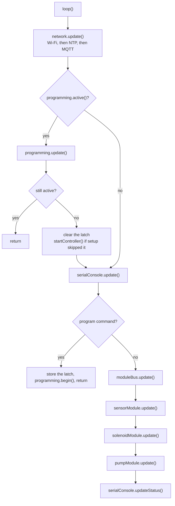

# Firmware architecture

[Home](home.md)

## Summary

The controller is seven modules. Each one has a small interface and hides its state machines. `src/main.cpp` is the composition root: it constructs the ESP32 adapters, passes timing constants and `kMqttDeviceId`, and calls `begin` / `update`. It does not sequence the steps inside a module.

Logic depends on hardware ports in `lib/Interfaces/`. ESP32 adapters live in `lib/Drivers/`. Logic does not include Arduino headers.

## Where it sits

Global constructors run before `setup()`. The type modules register their MQTT handlers there, so they exist before `Network::begin()`. `startController()` then calls `moduleBus.begin()`, `network.begin()`, and `serialConsole.begin()`. A latched ISP session skips that until the session ends.

`kMqttDeviceId` in `src/main.cpp` is the MQTT topic root used when `mqtt_prefix` is not stored. The layout does not invent that id. `{id}` below means that root. Setting it is described in [configuration.md](configuration.md). Every topic, and a payload to publish when testing, is in the [MQTT reference](reference/mqtt.md).

## What main creates

```text
main.cpp
  Network
    WifiManager
    NtpService
    MqttService
    MqttTopicLayout
    PreferenceNetworkConfigStore
    NetworkRuntime
  ModuleBus
    ModuleHost
      SlotController
    ModuleSlotPublisher
  SensorModule
    SensorPoller
    SensorMqttBridge
  SolenoidModule
    SolenoidPoller
    SolenoidMqttBridge
  PumpModule
    PumpPoller
    PumpMqttBridge
  SerialConsole
    SerialConfigController
    SerialStatusReporter
  Programming
    ProgrammingSession
    IspProgrammer
```

The ESP32 adapters (clock, Wi-Fi, NTP, MQTT, preferences, I2C, GPIO, USB serial, SPI, and the programming latch) are also constructed in `main.cpp` and passed in. Sibling modules reach inside `Network` or `ModuleBus` through a private accessor. `main.cpp` does not call those accessors. On the bus, each `SlotController` holds one slot. `ModuleHost` calls I2C. `ModuleSlotPublisher` publishes that slot's public snapshot. The handoff is on the [module bus](module-bus.md) page.

## One pass

`loop()` always calls `network.update()` first. Inbound MQTT commands are queued there. `update()` methods do not wait on the network. Wi-Fi and MQTT retries use wrap-safe elapsed time and exponential backoff. An I2C transaction is bounded by the host's 50 ms timeout.



An immediate `status` prints inside `serialConsole.update()`, before the modules. The periodic snapshot is `updateStatus()`, after them, so it matches this pass. Heap and PSRAM lines stay in `main.cpp` and print when USB is plugged in.

While a session is active, Wi-Fi, NTP, and MQTT keep running. The console, the bus, and the type modules do not. Desired solenoid and pump commands wait. Their absence windows keep counting, so a session longer than the cutoff turns those outputs off on the next module update.

## Modules

| Module | Interface | What one `update()` does | Page |
| --- | --- | --- | --- |
| `Network` | `begin`, `update`, `publish`, `addMessageHandler`, `apply`, `config` | Wi-Fi, then NTP, then MQTT | [Network](networking.md) |
| `SerialConsole` | `begin`, `update`, `updateStatus` | `update` reads USB lines. `updateStatus` prints the snapshot after the modules | [Serial console](serial-console.md) |
| `ModuleBus` | `begin`, `update`, `quiesce`, `resume` | At most one I2C transaction, then slot status if the text changed | [Module bus](module-bus.md) |
| `SensorModule` | `update` | At most one sensor exchange, then publish what it stored | [Sensor](sensor-module.md) |
| `SolenoidModule` | `update` | At most one solenoid exchange, then publish what it stored | [Solenoid](solenoid-module.md) |
| `PumpModule` | `update` | At most one pump exchange, then publish what it stored | [Pump](pump-module.md) |
| `Programming` | `begin`, `update`, `active` | STK500 until idle timeout or a confirmed unplug | [Programming](programming.md) |

Poll intervals and command-absence cutoffs are named constants in `src/main.cpp` and are passed into the type modules. Sensor, solenoid, and pump polls are 60 seconds. A solenoid command absent for 15 minutes turns every output off. A pump on/off command absent for 3 minutes turns the pump off. A pump reset does not refresh that window.

`Network` accepts at most four inbound handlers. Sensor, solenoid, and pump register one each, in their constructors. `begin` loads the stored record over the defaults from `main.cpp`, then starts Wi-Fi, MQTT, and NTP. `apply` persists the selected fields and pushes Wi-Fi or MQTT only after that save. An empty broker host stays unconfigured and does not call `connect`.

## Seams

A seam is a contract with two adapters. Hardware ports (`IClock`, `IWifi`, `INtpAdapter`, `IMqttClient`, `IPreferenceStore`, `ISerialPort`, `IBytePort`, `IDigitalPin`, `ISpiMaster`, `I2cMaster`) have an ESP32 driver and a desktop fake. `INetworkConfigStore` lives in `lib/Logic/Network/` because `PreferenceNetworkConfigStore` and `FakeNetworkConfigStore` are both real adapters. It is not a hardware port. Port behaviour is in [interfaces.md](interfaces.md).

Do not add an interface so one logic class can be replaced by a fake. `WifiManager`, `NtpService`, `MqttService`, `ModuleHost`, and the pollers stay as classes inside their module. Their existing tests stay, because those tests cover edges the module tests do not replace.

## Folders

- `lib/Interfaces/` contains the hardware ports and `ModuleProtocol.h`.
- `lib/Drivers/` contains the ESP32 adapters.
- `lib/Logic/` is one PlatformIO library. Sources live in `Network`, `Console`, `Bus`, `Sensor`, `Solenoid`, `Pump`, and `Programming`.
- `test/test_desktop/fakes/` contains the desktop adapters.
- `test/test_desktop/` contains Unity tests. `test_main.cpp` calls each file's runner. `test_deep_modules.cpp` drives the seven modules. The other files drive the classes inside them.
- `src/main.cpp` composes the product.

`platformio.ini` lists `lib_deps = Logic` on both environments. The library finder does not compile sources that live in subfolders unless the library is named. The `-I lib/Logic/...` flags only expose the headers. Leave `lib_deps` in place.

## Desktop testing

Tests run on the desktop with PlatformIO's `native` environment:

```text
C:\Users\Nathan\.platformio\penv\Scripts\platformio.exe test -e native
```

`test_deep_modules.cpp` drives each module through its public interface: connect and backoff, apply and persistence, empty-broker refusal, slot publish and enumeration, prefix changes, sensor and solenoid and pump commands, absence windows, programming quiesce, and the serial console. The older files keep the inner edges: retry sequences, frame codecs, enumeration faults, poller cycles, and the STK500 command set.

The fakes simulate link state, RSSI, time, broker outcomes, subscriptions, publications, inbound messages, persisted settings, USB presence, serial bytes, GPIO levels, and I2C slaves. The RTC programming marker is ESP32-only and is not in these tests. Production builds use `lib/Drivers/`. Test code and fakes are not included.
