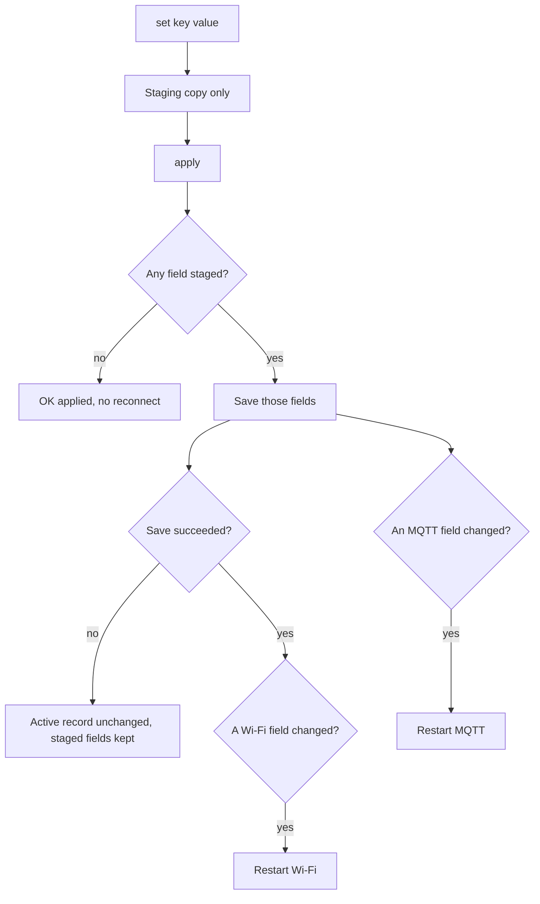

# Runtime configuration

[Home](home.md) · Reference: [Commands and stored fields](reference/configuration.md)

## Summary

`set` stages one field. `apply` stores only the fields staged since the last successful apply, then restarts Wi-Fi when a Wi-Fi field changed and MQTT when an MQTT field changed. A failed save leaves the active record unchanged and leaves the staged fields in place for a retry. An empty `apply` replies `OK applied` and does not reconnect.

## Where it sits

`SerialConfigController`, inside [Serial console](serial-console.md), parses complete lines while USB is plugged in. `NetworkRuntime`, inside [Network](networking.md), owns the active strings and the staged copy. `PreferenceNetworkConfigStore` writes them through `IPreferenceStore`.

## One apply

Setting a credential or a broker field to an empty string stores that empty string. An empty MQTT host stays `Unconfigured` and does not call `connect`.

## The three names

| Setting | Command | Missing key |
| --- | --- | --- |
| DHCP hostname | `set wifi.hostname` | `watering-controller` from `setup()`, not written until applied |
| MQTT client id | `set mqtt.client` | `watering-controller`, then saved on boot |
| Topic prefix `{id}` | `set mqtt.prefix` | `kMqttDeviceId` in `src/main.cpp` (`watering`), not written until applied |

The layout does not invent `watering`. The hostname, the client id, and the prefix are independent. A DHCP rename does not move topics. Two boards on one broker need different client ids and different prefixes. Commissioning sets all three to the same name. The character rules, the replies, and that example are in the [configuration reference](reference/configuration.md).

`{id}` in the other pages is this prefix.

## See also

- [Configuration reference](reference/configuration.md) — every key, NVS names, prefix generation.
- [Serial console](serial-console.md)
- [Network](networking.md)
