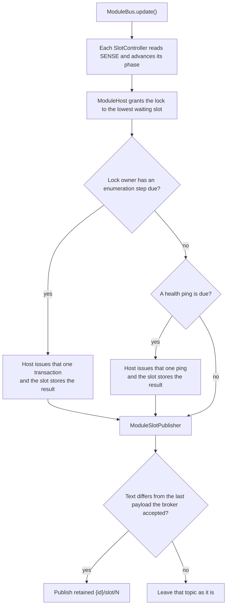

# Module bus

[Home](home.md)

Reference: [pins, phases, the lock, and publication](reference/module-bus.md).

## Summary

`ModuleBus` is the four-slot I2C bus. `main.cpp` creates it. A `SlotController` holds each slot's state. `ModuleHost` owns those four controllers, grants the enumeration lock, and is the class that talks to the I2C master. `ModuleSlotPublisher` reads the public snapshot and publishes a retained slot line when that line's text changed. Each `update()` lets the host do at most one I2C transaction, then asks the publisher. Sensor, solenoid, and pump borrow the same host later in the pass, each for one transaction of their own.

## Where it sits

`main.cpp` constructs `ModuleBus` with the I2C master, the clock, the four sense / MOD / CS pin sets, and `Network`. `loop()` calls `moduleBus.update()` after the console has read a command, and before the type modules. See [Architecture](architecture.md).

`Programming::begin()` calls `quiesce()` so the bus stays quiet during an ISP session, and `resume()` when the session ends. `loop()` skips `moduleBus.update()` for the whole session, so the publisher is quiet then too.

## What it creates

```text
main.cpp
  ModuleBus                 calls the host, then the publisher
    ModuleHost              owns the four controllers, the lock, and the I2C calls
      SlotController        one per slot; holds that slot's state and proposes the next step
    ModuleSlotPublisher     turns the public snapshot into retained {id}/slot/1 .. {id}/slot/4
```

`SlotController` watches SENSE, MOD, and CS for its slot. It remembers the phase, the address, the identity, and the last fault, and it proposes the next I2C operation. `ModuleHost` performs that operation and writes the result back onto the same controller. `ModuleSlotPublisher` reads the public snapshot through the host. I2C stays in the host. MQTT stays in the publisher.

## How they link

```text
each SlotController advances its pins
        |
ModuleHost grants the lock to the lowest slot that wants it
        |
the lock owner's enumeration step, else one due health ping, else no I2C
        |
applyI2cResult() on that slot when a transaction ran
        |
ModuleSlotPublisher reads every slot's public snapshot
        |
retained {id}/slot/N for each body the broker has not accepted yet
```

The lock owner's enumeration step is the transaction when one is due. A slot can hold the lock while it waits out the MOD settle or a retry gap. On those passes it proposes nothing, and a health ping for another slot can use the transaction. With neither due, the pass has no I2C. The publisher still runs, and it skips any slot whose text the broker already accepted.

## One update



Sibling modules reach the host through `ModuleBus::host()`. `main.cpp` does not call that. A type module's `exchange()` is a later call in the same `loop()` pass. It uses the address and type the slot controller stored.

## What is stored, and who reads it

Each `SlotController` stores that slot:

- the private phase, which `state()` folds into `Empty`, `Debouncing`, `Enumerating`, `Online`, `Unsupported`, or `Fault`
- the assigned address, which stays 0 until a ping at that address succeeds. The ping follows `SET_ADDRESS`, or it follows three NACKs at `0x0A`. The slot address is `0x10` plus the slot index. Unplug and a controller reset both clear it.
- type id, protocol version, firmware version, and identity epoch
- the last fault (`None`, `Nack`, `BadCrc`, `BadFrame`, `Timeout`, or `Busy`)

`identityEpoch` increases by one each time `GET_IDENTITY` succeeds, including after the module restarts. Sensor, solenoid, and pump read it through the host. They clear that slot's cached readings when the slot leaves their type, and when this count changes.

`ModuleHost` stores which slot holds the enumeration lock (`-1` when the lock is free) and which slot to ask next for a health ping. Its readers (`state`, `address`, `typeId`, `protocolVersion`, `firmwareVersion`, `identityEpoch`, `fault`, `typeName`) forward to the matching controller. An out-of-range index reads as empty.

`ModuleSlotPublisher` stores, per slot, the last payload the broker accepted and whether that publish succeeded, plus the topic generation those payloads belong to. Every update builds the text again from the host. The words come from `writeSlotStatusBody` in `SlotStatusText`: `Empty`, `Debouncing`, `Enumerating`, `Online Sensor addr=0x10`, `Unsupported type=0x02AA addr=0x12`, `Fault Nack`. Firmware index 0 is topic `{id}/slot/1`.

- `SerialConsole` prints that same body with a `Slot N:` prefix.
- `SensorModule`, `SolenoidModule`, and `PumpModule` call `exchange()` for their own command after this `update()` has returned, and they keep their own samples.
- `Programming` calls `quiesce()` and `resume()`. While the host is quiesced, an `update()` leaves every slot where it is.

## See also

- [Module bus reference](reference/module-bus.md) — the phase map, the publisher's retry rule, pins, the lock, faults, and health pings.
- [MQTT reference](reference/mqtt.md) — the slot topics, and the payload text.
- [What a daughter module must do](daughter/contract.md)
- [Architecture](architecture.md)
