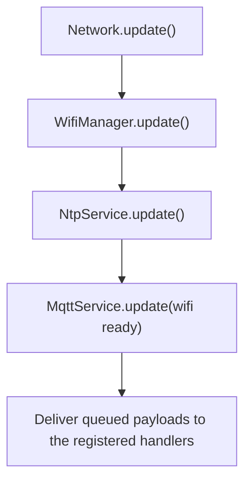

# Network

[Home](home.md) · Reference: [Network](reference/networking.md)

## Summary

`Network` is Wi-Fi, NTP, MQTT, and the stored settings. `update()` runs those three in that order and does not decode sensor, solenoid, or pump commands. Inbound payloads are delivered to the handlers those modules registered.

An empty broker host stays unconfigured and does not call `connect`.

## Where it sits

`main.cpp` constructs it with the Wi-Fi, NTP, and MQTT adapters, the clock, the preference store, `kMqttDeviceId`, `kNtpConfig`, and `kNetworkTiming`. `startController()` calls `network.begin()` after `moduleBus.begin()`. `loop()` calls `network.update()` first on every pass, including while an ISP session is active.

The type modules exist before `begin()`, because their constructors register handlers.

## What it creates

```text
main.cpp
  Network
    WifiManager                      Idle, Connecting, Connected, Backoff
    NtpService                       Idle, WaitingForSync, Synchronized
    MqttService                      connect, subscribe, publish
    MqttTopicLayout                  topic strings and the generation counter
    PreferenceNetworkConfigStore     NVS through IPreferenceStore
    NetworkRuntime                   active record, staged edits, apply
```

`main.cpp` does not call those classes. Sibling modules reach MQTT and the topic tree through private accessors.

## One update



None of these steps waits for a connection. Retries use wrap-safe elapsed time and capped exponential backoff.

`begin()` loads the stored record over the defaults from `main.cpp`, then starts Wi-Fi, MQTT, and NTP. `apply` stores the staged fields and pushes Wi-Fi or MQTT only after that save.

## What is stored, and who reads it

`NetworkRuntime` holds the active strings. Staged serial edits cannot change them before `apply`. `MqttTopicLayout` holds the topic tree for `{id}`. Its generation starts at 1 and increases when the id text changes, so publishers send their current values once under the new root.

`{id}` is `kMqttDeviceId` (`watering`) until `mqtt_prefix` is stored. The layout does not invent that id. Setting it is described in [Configuration](configuration.md).

The hostname, the MQTT client id, and the topic prefix are three different settings.

## See also

- [Network reference](reference/networking.md) — states, subscriptions, the generation counter, the config store.
- [MQTT reference](reference/mqtt.md) — every command, result, and a payload to publish when testing.
- [Configuration](configuration.md)
- [Architecture](architecture.md)
