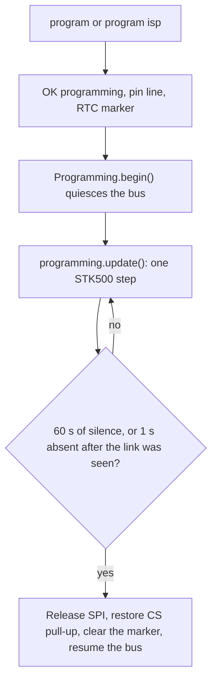

# Programming

[Home](home.md) · Reference: [Programming](reference/programming.md)

## Summary

`Programming` is an Arduino-as-ISP session for an ATmega328PB on firmware slot 1. `program` or `program isp` quiesces the module bus and hands the USB port to STK500. The pump board is an ATtiny1614 on UPDI. `program updi` replies `ERR program`.

## Where it sits

`main.cpp` constructs it with the USB byte port, the SPI master, slot 1 CS, `ModuleBus`, the clock, `kProgrammingIdleTimeoutMs` (60 seconds), and `kProgrammingUnplugTimeoutMs` (1 second). `loop()` calls `network.update()` first. While `active()` is true it calls `programming.update()` and returns, unless the session ended on that pass.

`serialConsole.update()` recognizes `program` and returns before the bus. `loop()` then stores the RTC latch and calls `begin()`.

## What it creates

```text
main.cpp
  Programming
    ProgrammingSession     silence timer and the seen-then-absent unplug rule
    IspProgrammer          STK500v1 subset avrdude uses, 125 kHz SPI
```

`begin()` quiesces the bus and holds reset idle-high. While the session is active the console, the bus, and the type modules do not run. Wi-Fi, NTP, and MQTT do. Desired solenoid and pump commands wait, and their absence windows keep counting.

## One update



A USB-open restart keeps the marker, so `setup()` enters STK500 without the banner and without `startController()`. The reset button and a power cycle clear it. Pins, the signature, and the reset pulses are in the reference.

## What is stored, and who reads it

The latch is one word in RTC slow memory (`.rtc_noinit`). `setup()` reads it. `loop()` clears it when the session ends. Ending the session does not reset the chip. If init already ran, the power-on lines are not printed again.

## See also

- [Programming reference](reference/programming.md) — jumper pins, STK500, the unplug rule, tests.
- [MQTT reference](reference/mqtt.md) — commands that can still arrive while a session is active.
- [Serial console](serial-console.md)
- [Module bus](module-bus.md)
- [Architecture](architecture.md)
