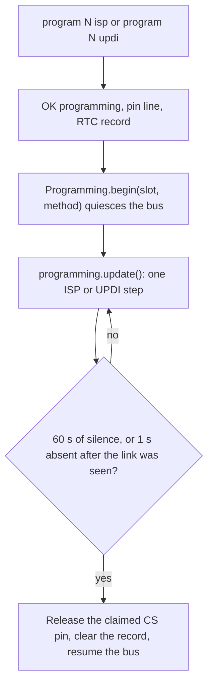

# Programming

[Home](home.md) · Reference: [Programming](reference/programming.md)

## Summary

`Programming` is an ISP or UPDI session on one firmware slot, 1 through 4. `program 1 isp` uses the shared SPI pins and that slot's CS pin as RESET. `program 3 updi` uses only that slot's CS pin as the UPDI wire. A line without both a slot and a method replies `ERR program` and does not start a session.

## Where it sits

`main.cpp` constructs it with the USB byte port, the SPI master, the half-duplex UART, the four CS pins, `kProgrammingPins`, `ModuleBus`, the clock, `kProgrammingIdleTimeoutMs` (60 seconds), and `kProgrammingUnplugTimeoutMs` (1 second). `loop()` calls `network.update()` first. While `active()` is true it calls `programming.update()` and returns, unless the session ended on that pass.

`serialConsole.update()` recognizes the program line and returns before the bus. `loop()` then stores the RTC latch and calls `begin(slot, method)`.

## What it creates

```text
main.cpp
  Programming
    ProgrammingSession     silence timer and the seen-then-absent unplug rule
    IspProgrammer          STK500v1 subset avrdude uses, 125 kHz SPI
    UpdiProgrammer         jtag2updi, one open-drain GPIO, 115200 8E2
```

`begin(slot, method)` quiesces the bus. A slot outside 1..4 returns without quiescing. A second `begin` while the session is active does not rebind the pin or the UART. While the session is active the console, the bus, and the type modules do not run. Wi-Fi, NTP, and MQTT do. Desired solenoid and pump commands wait, and their absence windows keep counting.

## One update



A USB-open restart keeps the record, so `setup()` enters the same slot and method without the banner and without `startController()`. The reset button and a power cycle clear it. An older single-word ISP marker does not resume. Pins, the two host tools, and the wire sequences are in the reference.

## What is stored, and who reads it

The latch is one record in RTC slow memory (`.rtc_noinit`): magic, slot, and method. `setup()` reads it. `loop()` clears it when the session ends. Ending the session does not reset the chip. If init already ran, the power-on lines are not printed again.

## See also

- [Programming reference](reference/programming.md) — jumper pins, STK500, jtag2updi, the unplug rule, tests.
- [Configuration reference](reference/configuration.md) — the accepted `program` lines and `ERR program`.
- [MQTT reference](reference/mqtt.md) — commands that can still arrive while a session is active.
- [Serial console](serial-console.md)
- [Module bus](module-bus.md)
- [Architecture](architecture.md)
