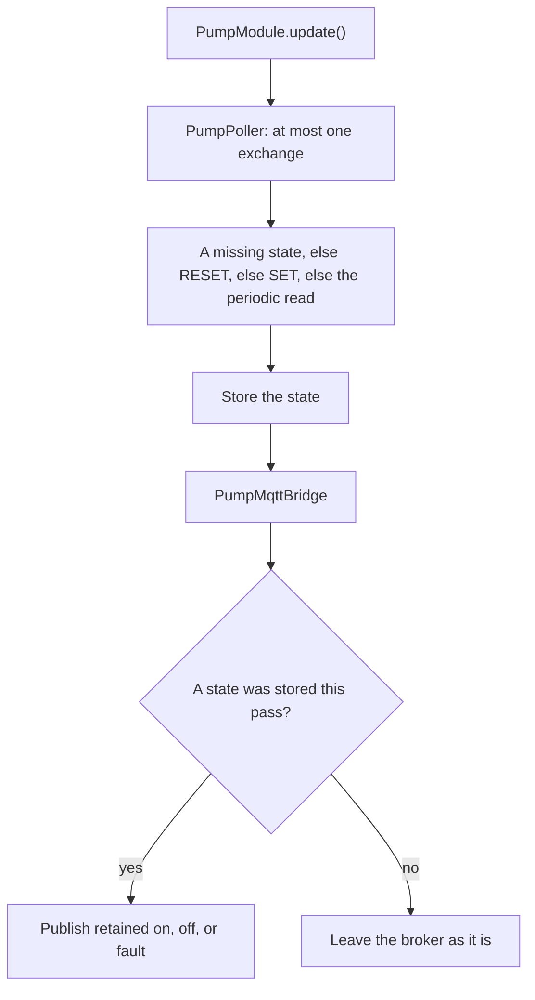

# Pump module

[Home](home.md) · Reference: [Pump](reference/pump-module.md)

## Summary

`PumpModule` talks to daughter boards of type `0x0300`. A board drives one pump. The module reads it when the board is identified, reads it again on the poll interval, and publishes `on`, `off`, or `fault`. `{id}/pump` names the desired on or off state, or asks for a reset. `SET_PUMP` is sent only when the known state differs, and it is not sent while the pump is faulted.

If no accepted on/off command arrives for `kPumpCommandTimeoutMs` (3 minutes), a pump that is on is turned off. A reset does not refresh that window, and it does not clear a fault by itself. `RESET_PUMP` is sent only after `{id}/pump` says `reset`.

## Where it sits

`main.cpp` constructs it with `ModuleBus`, `Network`, the clock, `kPumpPollIntervalMs` (60 seconds), and the absence window. The constructor registers the `{id}/pump` handler. `loop()` calls `pumpModule.update()` after the solenoid module.

## What it creates

```text
main.cpp
  PumpModule
    PumpPoller         one query per pass; per-slot state and timer
    PumpMqttBridge     records on, off, or reset; publishes the stored state
```

The callback only records the request. `ModuleHost` is the only I2C caller. This exchange is separate from the host transaction and from the sensor and solenoid queries.

## One update



A reset waits until the state is known. When it returns off or on and the desired state still differs, a later pass sends `SET_PUMP`. A reset that still returns fault is published and not followed by `SET_PUMP`.

## What is stored, and who reads it

Each slot keeps its own state, desired on/off, and poll timer. The absence window is one timer for every pump: any accepted on/off command restarts it. Faulted pumps are not reset when the window elapses. The bridge publishes `{id}/slot/N/pump`. Unplug publishes retained `unavailable` once.

Serial status prints the slot line only. The pump state is the MQTT payload.

## See also

- [Pump reference](reference/pump-module.md) — commands, reset, the cutoff, tests.
- [MQTT reference](reference/mqtt.md) — the pump topics, and a payload to publish when testing.
- [Daughter contract](daughter/contract.md)
- [Module bus](module-bus.md)
- [Architecture](architecture.md)
