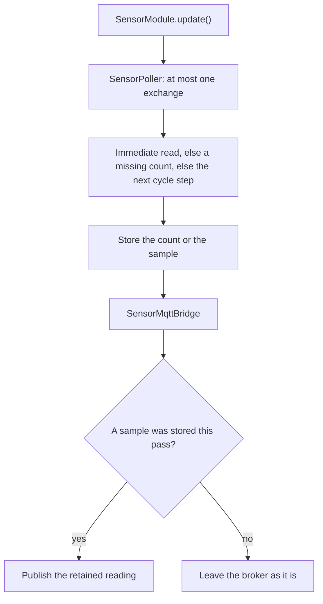

# Sensor module

[Home](home.md) · Reference: [Sensor](reference/sensor-module.md)

## Summary

`SensorModule` talks to daughter boards of type `0x0200`. A board reports up to 16 inputs. The module learns that count when the board is identified, then reads presence and a raw value for each input. Every stored reading is published, including a repeated value.

Wire indexes are 0-based. MQTT slot and sensor numbers are 1-based. The controller does not scale the value.

## Where it sits

`main.cpp` constructs it with `ModuleBus`, `Network`, the clock, and `kSensorPollIntervalMs` (60 seconds). The constructor registers the `{id}/sensor/read` handler, before `Network::begin()`. `loop()` calls `sensorModule.update()` after `moduleBus.update()` and before the solenoid module.

## What it creates

```text
main.cpp
  SensorModule
    SensorPoller         one query per pass; per-slot count, samples, and timer
    SensorMqttBridge     publishes stored readings; the callback only enqueues
```

`ModuleHost`, inside the bus, is the only I2C caller. The poller's exchange is separate from the one transaction inside `moduleBus.update()`.

## One update



The callback for `{id}/sensor/read` only enqueues a slot and a sensor index. The poller sends `GET_SENSOR_READING` on a later pass. While the count is still unknown, that request waits and the count query runs instead.

## What is stored, and who reads it

Each slot keeps its own count, samples, revision, and poll timer. The bridge reads those and publishes `{id}/slot/N/sensor/M` when a reading was stored. Unplug publishes retained `unavailable` once for that slot's inputs. Another slot keeps its own cache.

Serial status prints the slot line (`Online Sensor addr=0x10`). It does not print individual inputs.

## See also

- [Sensor reference](reference/sensor-module.md) — commands, poll order, publish rules, tests.
- [Daughter contract](daughter/contract.md)
- [Module bus](module-bus.md)
- [Architecture](architecture.md)
