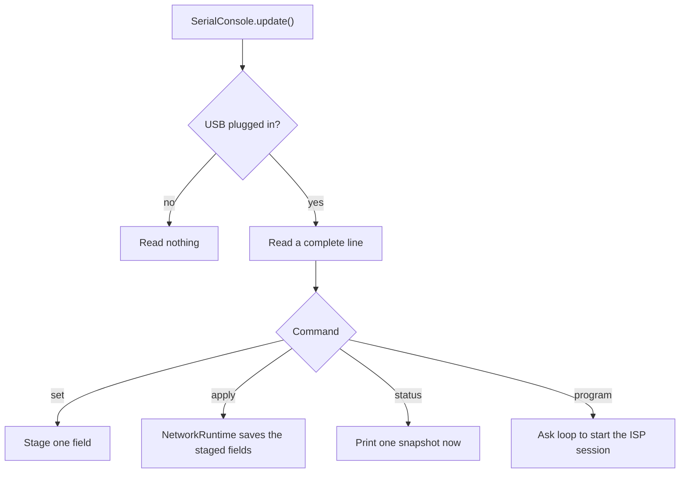

# Serial console

[Home](home.md) · Reference: [Serial console](reference/serial-console.md)

## Summary

`SerialConsole` reads USB command lines and prints the status snapshot. `update()` reads lines. `updateStatus()` prints the snapshot after the modules, so the slot lines match this pass. An immediate `status` command prints inside `update()`, before the modules.

USB plug state gates input and both kinds of print. Heap and PSRAM lines stay in `main.cpp`. They are not part of this snapshot.

## Where it sits

`main.cpp` constructs it with the serial port, the clock, `Network`, `ModuleBus`, and `kSerialStatusIntervalMs` (10 seconds). `startController()` calls `serialConsole.begin()` after `network.begin()`. `loop()` calls `update()` before the bus, and `updateStatus()` after the pump module.

## What it creates

```text
main.cpp
  SerialConsole
    SerialConfigController     set, apply, status, program
    SerialStatusReporter       Wi-Fi, NTP, MQTT, and four slot lines
```

The reporter is constructed with the Wi-Fi, NTP, and MQTT services from `Network`, and with `ModuleHost` from `ModuleBus`. `main.cpp` does not construct it. It reads snapshots only. It does not call `ping()` or `echo()`.

## One pass



`updateStatus()` prints the same snapshot when periodic reporting is on, the link is plugged in, and `kSerialStatusIntervalMs` has elapsed. `status` prints even when periodic reporting is off. It does not change the on/off flag. A successful immediate print restarts the wait until the next periodic snapshot.

A slot that reaches `Fault Nack` also prints one line, `Slot N: Nack`, on the next `updateStatus()`. That line is not repeated while the slot keeps failing and retrying. It is printed again after the slot is empty, online, or unsupported and then faults again. The I2C driver does not print its own NACK line.

`program` inside `update()` makes `loop()` store the RTC latch and call `programming.begin()` before the bus runs. The command list is in [Configuration](configuration.md). The session is in [Programming](programming.md).

## What is stored, and who reads it

Staged fields live in `NetworkRuntime` until `apply`. The on/off flag is the NVS key `status_report`. The snapshot interval is session RAM from `main.cpp`. No command stores it. Reboot restores 10 seconds.

The four slot lines come from `ModuleHost` public snapshots. Wi-Fi, NTP, and MQTT lines come from those services.

## See also

- [Serial console reference](reference/serial-console.md) — the seven lines, plug gating, tests.
- [Configuration](configuration.md)
- [Programming](programming.md)
- [Architecture](architecture.md)
