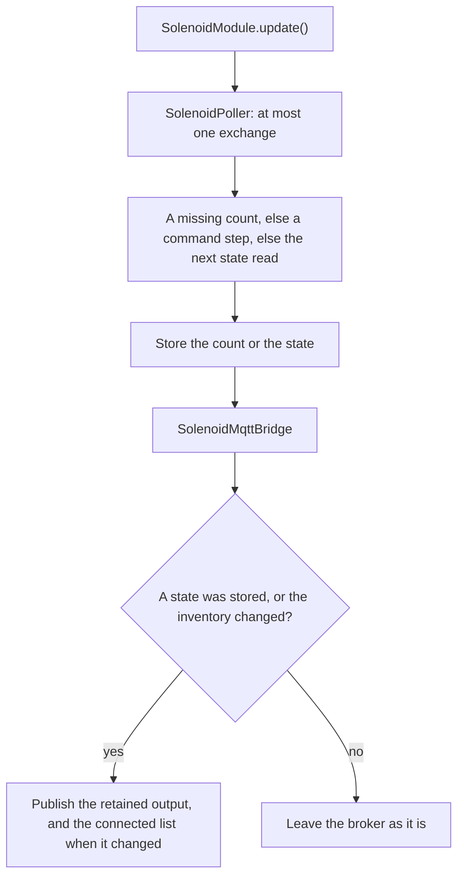

# Solenoid module

[Home](home.md) · Reference: [Solenoid](reference/solenoid-module.md)

## Summary

`SolenoidModule` talks to daughter boards of type `0x0100`. A board drives up to 16 outputs. The module learns that count when the board is identified, reads each output, and publishes `on`, `off`, or `disconnected`. An MQTT command names the desired on/off state of every output. The module sends `SET_SOLENOID` only where the known state differs.

If no accepted command arrives for `kSolenoidCommandTimeoutMs` (15 minutes), every output is turned off. Commands are expected about once a minute, and each one names the full set.

## Where it sits

`main.cpp` constructs it with `ModuleBus`, `Network`, the clock, `kSolenoidPollIntervalMs` (60 seconds), and the absence window. The constructor registers the handler for `{id}/solenoids` and `{id}/solenoids/connected`. `loop()` calls `solenoidModule.update()` after the sensor module.

## What it creates

```text
main.cpp
  SolenoidModule
    SolenoidPoller         one query per pass; per-slot count, states, and timer
    SolenoidMqttBridge     records desired state; publishes stored states
```

The callback only records the desired state. It does not touch I2C. `ModuleHost` is the only I2C caller. This exchange is separate from the host transaction and from the sensor query, so one `loop()` can carry one of each.

## One update



A command step reads an output whose state is still unknown, or sends `SET_SOLENOID` where the known state differs. A disconnected output is left alone. A command whose word count does not match the module count is not applied.

## What is stored, and who reads it

Each slot keeps its own count, output states, desired state, and poll timer. The absence window is one timer for the whole controller: any accepted `{id}/solenoids` command restarts it. The bridge publishes `{id}/slot/N/solenoid/M` from the stored state, and `{id}/slot/N/solenoids` as the count plus the connected indexes.

Serial status prints the slot line only.

## See also

- [Solenoid reference](reference/solenoid-module.md) — commands, the cutoff, the inventory, tests.
- [MQTT reference](reference/mqtt.md) — the solenoid topics, and a payload to publish when testing.
- [Daughter contract](daughter/contract.md)
- [Module bus](module-bus.md)
- [Architecture](architecture.md)
